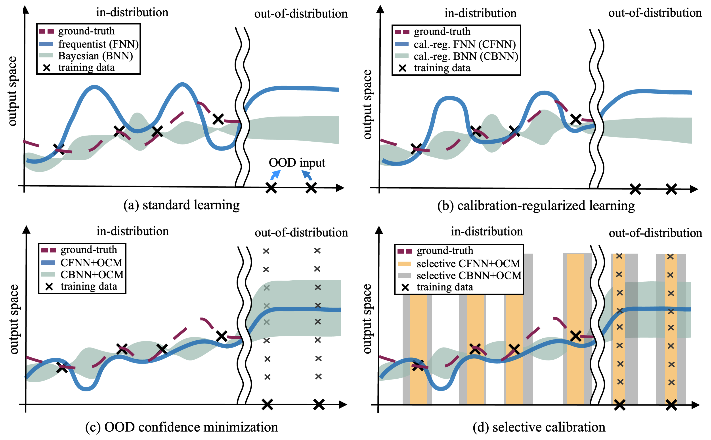

# Calibrating Bayesian Learning via Regularization, Confidence Minimization, and Selective Inference

[](https://arxiv.org/pdf/2404.11350)
[](https://pytorch.org/)
[](https://github.com/torrvision/focal_calibration/blob/main/LICENSE)

This repository contains the code for [*Calibrating Bayesian Learning via Regularization, Confidence Minimization, and
Selective Inference*](https://arxiv.org/abs/2002.09437), some elements still in progress.

If the code or the paper has been useful in your research, please add a citation to our work:

```
@article{huang2024calibrating,
  title={Calibrating Bayesian Learning via Regularization, Confidence Minimization, and Selective Inference},
  author={Huang, Jiayi and Park, Sangwoo and Simeone, Osvaldo},
  journal={arXiv preprint arXiv:2404.11350},
  year={2024}
}
```

## Summary

Figure 1: (a) Standard *frequentist neural networks* (FNNs) generally fail to provide well-calibrated decisions, and improved *in-distribution* (ID) calibration can be achieved via *Bayesian neural networks* (BNNs). (b)* Calibration regularization *improves ID calibration via a regularizer that penalizes calibration errors. (c)* Out-of-distribution confidence minimization *(OCM) injects OOD examples during training to improve OOD detection. (d)* Selective calibration *further improves both ID and OOD calibration by only producing decisions for inputs at which uncertainty quantification is deemed to be sufficiently reliable. Prior works introduced calibration regularization, OCM, and selective calibration as separate methods for FNNs, while this work presents an integrated approach encompassing all three solutions for BNNs.


## Dependencies

The code is based on PyTorch and requires a few further dependencies, listed in [environment.yaml](environment.yaml). It should work with newer versions as well.

### Datasets

The *in-distribution* (ID) data set, i.e., CIFAR-100, will be downloaded directly on running the code. However, the *out-of-distribution* OOD data set, i.e., [Tiny ImageNet (resized)](https://tiny-imagenet.herokuapp.com/), needs to be downloaded separately for the data loader to work.

## Training a model (calibrating-regularized learning w/o OCM)

In order to train a WideResNet-40-2 model, please use the following code: 

(1) ```python ./Regularization-and-OCM/FNN/train_fnn.py``` for frequentist neural networks (FNNs), or calibration-regularized FNNs (CFNNs), with some important parameters as below
```
--dataset: cifar100
--model: wideresnet402
--loss: loss function of choice (cross_entropy/mmce_weighted)
--lamda: lamda value for calibrating regularizer (0/3, depending on its loss function)
```
(2) ```python ./Regularization-and-OCM/FNN/train_fnn_ocm.py``` for FNN with OCM (FNN-OCM), or CFNN with OCM (CFNN-OCM), with some important parameters as below
```
--dataset: cifar100
--model: wideresnet402
--loss: loss function of choice (cross_entropy/mmce_weighted)
--lamda: lamda value for calibrating regularizer (0/3, depending on its loss function)
--ow: gamma value for OCM regularizer (0.5)
```
(3) ```python ./Regularization-and-OCM/FNN/train_bnn.py``` for Bayesian neural networks (BNNs), or calibration-regularized BNNs (CBNNs), with some important parameters as below
```
--dataset: cifar100
--model: bayes_wideresnet_40_2
--loss: loss function of choice (cross_entropy/mmce_weighted)
--lamda: lamda value for calibrating regularizer (0/0.8, depending on its loss function)
```
(4) ```python ./Regularization-and-OCM/FNN/train_bnn_ocm.py``` for BNN with OCM (BNN-OCM), or CBNN with OCM (CBNN-OCM), with some important parameters as below
```
--dataset: cifar100
--model: bayes_wideresnet_40_2
--loss: loss function of choice (cross_entropy/mmce_weighted)
--lamda: lamda value for calibrating regularizer (0/0.8, depending on its loss function)
--ow: gamma value for OCM regularizer (0.5)
```


[//]: # ()
[//]: # ()
[//]: # ()
[//]: # (&#40;5&#41; ```python ./Selective-Inference/FNN/train_fnn_ocm.py```)

[//]: # ()
[//]: # ([train.py]&#40;train.py&#41; code. The default configuration &#40;i.e., just running ```python train.py```&#41; will train a ResNet50 model on the cross-entropy loss function. The following are the important parameters of the training:)

[//]: # (```)

[//]: # (--dataset: dataset to train on [cifar10/cifar100/tiny_imagenet])

[//]: # (--dataset-root: path of the Tiny ImageNet dataset &#40;not necessary for CIFAR-10/100&#41;)

[//]: # (--loss: loss function of choice &#40;cross_entropy/focal_loss/focal_loss_adaptive/mmce/mmce_weighted/brier_score&#41;)

[//]: # (--gamma: gamma for focal loss)

[//]: # (--lamda: lambda value for MMCE)

[//]: # (--gamma-schedule: whether to use a scheduled gamma during training)

[//]: # (--save-path: path for saving models)

[//]: # (--model: model to train &#40;resnet50/resnet110/wide_resnet/densenet121&#41;)

[//]: # (```)

[//]: # ()
[//]: # (The shell scripts to train different models on different datasets are available in [train_scripts]&#40;train_scripts&#41; folder.)

[//]: # (As an example, in order to train a ResNet-50 model on CIFAR-10 using focal loss with ```gamma = 3```, we can write the following script:)

[//]: # (```)

[//]: # (python train.py --dataset cifar10 --model resnet50 --loss focal_loss --gamma 3.0)

[//]: # (``` )

## Evaluating a model (calibrating-regularized learning w/o OCM)

In order to evaluate a trained model, you can use the ```python ./Regularization-and-OCM/FNN/performance_test.py``` code for frequentist learning models and ```python ./Regularization-and-OCM/BNN/performance_test.py``` code for Bayesian learning models. 

As an example, to evaluate a WideResNet-40-2 model trained on CIFAR-100, run the code as:
```
For frequentist learning models:
python ./Regularization-and-OCM/FNN/performance_test.py

For Bayesian learning models:
python ./Regularization-and-OCM/BNN/performance_test.py
```

## Training a model (selective inference)
In order to train a selector based on the different pre-trained WideResNet-40-2 models, please use the following code: 

(1) running ```python ./Selective-Inference/bin/cifar/create_and_process.py``` to split the CIFAR-100 data set and to save all the logits produced by the pre-trained model as a file.

(2) running ```python ./Selective-Inference/bin/cifar/tools/generate_meta_features.py``` to generate the meta features (i.e., non-parametric outlier score vector and confidence score) by using the saved logit file in step (1), and the meta features will be used for training the selector later.

(3) running ```python ./Selective-Inference/bin/cifar/tools/train_selective_model.py``` to train the selector with the default settings as shown in the code.

## Evaluating a model (selective inference)
In order to evaluate the different selector based on the meta features obtained by different pre-trained WideResNet-40-2 models, please run the code  ```python ./Selective-Inference/bin/cifar/tools/selector.py```.


## Questions

If you have any questions or doubts, please feel free to open an issue in this repository or reach out to me at the provided email addresses: jiayi.3.huang@kcl.ac.uk .
